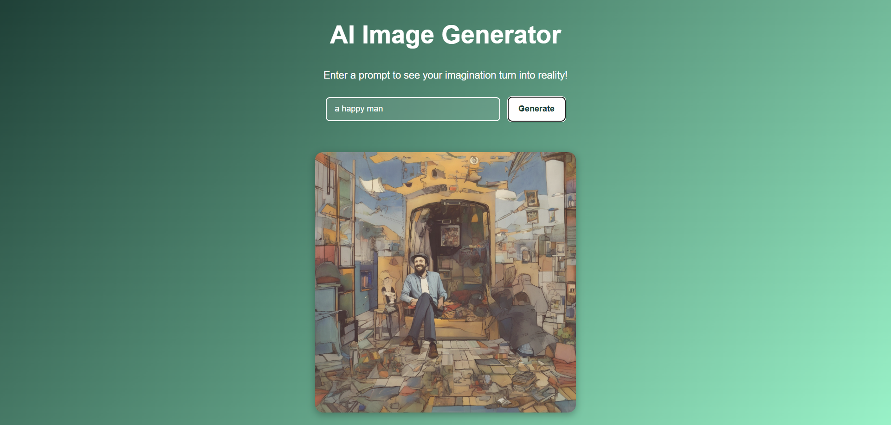

# Stable Diffusion Fine-Tuning and Cloud Function Deployment Guide

This repository provides a step-by-step guide to fine-tune a Stable Diffusion model on MSCoco Dataset and deploy it on Google Cloud Vertex AI. The Cloud Function will then be used to make predictions by calling the deployed model's endpoint. This repository contains two main components:
1. **Notebook**: A Jupyter notebook for fine-tuning the `stabilityai/stable-diffusion-xl-base-1.0` model.
2. **Cloud Function**: A deployed Cloud Function that uses your fine-tuned model on Google Cloud Vertex AI to make predictions. The Cloud Function exposes an HTTP endpoint and provides a user interface to interact with the model.


## Table of Contents
1. [Fine-Tuning the Stable Diffusion Model](#finetune-the-stable-diffusion)
2. [Save and Upload Model to Hugging Face](#save-and-upload-model-to-hugging-face)
3. [Deploy the Model on Vertex AI](#deploy-the-model-on-vertex-ai)
4. [Create an Endpoint on Vertex AI](#create-an-endpoint)
5. [Use the Cloud Function for Predictions](#use-the-cloud-function-for-predictions)
6. [Interface Screenshot](#interface-screenshot)

---

### 1. Fine-Tune the Stable Diffusion Model

In this step, we will fine-tune the `stabilityai/stable-diffusion-xl-base-1.0` model to customize it according to your needs. This is done using the Jupyter notebook provided in the `notebook` folder.

1. Open the `finetuning_stablediffusion.ipynb` file located in the `notebook` folder.
2. Follow the instructions in the notebook to fine-tune the model on your dataset. Ensure that you have the required dependencies installed and access to a suitable GPU for training.

---

### 2. Save and Upload Model to Hugging Face

1. After fine-tuning the model, upload the model to your Hugging Face repository.

   - If you don't have a Hugging Face account, [create one here](https://huggingface.co/join).
   - Once logged in, navigate to the "Models" section and create a new repository for your model.
   - Use the following command to upload your model to the newly created Hugging Face repo:

     ```bash
     huggingface-cli login
     git lfs install
     git clone https://huggingface.co/<your-huggingface-username>/<your-model-repo>
     cd <your-model-repo>
     git add <your-model-files>
     git commit -m "Initial model upload"
     git push
     ```

2. Your model is now available on Hugging Face.

---

### 3. Deploy the Model on Vertex AI

1. Go to the [Hugging Face Hub](https://huggingface.co) and navigate to the model repository you just uploaded.
2. On the model page, look for the option to **Deploy on GCP**.
3. Follow the prompts to deploy the model on Google Cloud Platform (GCP). During this process, you'll need to:
   - Select the region (e.g., `us-central1`).
   - Choose the machine type for deployment.
   - Provide authentication details for GCP.

---

### 4. Create an Endpoint

Once your model is deployed, you'll need to create an endpoint on Vertex AI to interact with your model.

1. Go to the [Vertex AI console](https://console.cloud.google.com/vertex-ai).
2. Navigate to the **Endpoints** section under **AI Platform**.
3. Click **Create Endpoint** and provide a name for the endpoint.
4. Select the model you just deployed and specify the location.
5. After creating the endpoint, you will receive an **endpoint ID** that will be used in the next step for prediction.

---

### 5. Use the Cloud Function for Predictions

Now that your model is deployed and an endpoint is created, you can use the provided cloud function to interact with it. The `cloud_function` folder contains the necessary files to set up the cloud function:

1. **index.html**: This is the HTML frontend that allows users to input prompts for image generation.
2. **main.py**: This is the Flask-based cloud function that interacts with the model's endpoint.
3. **requirements.txt**: This file lists the dependencies required to run the cloud function.
4. **.env**: This file contains environment variables like `GOOGLE_APPLICATION_CREDENTIALS` for authentication.
5. **token.json**: This file is used for authentication with Google Cloud services.

### How to Use:

1. **Set up the Environment**:
   - Make sure you have Google Cloud SDK installed and configured.
   - Set the `GOOGLE_APPLICATION_CREDENTIALS` environment variable to point to your service account credentials file.

2. **Deploy Cloud Function**:
   - Use the following command to deploy the function to Google Cloud Functions:

     ```bash
     gcloud functions deploy serve \
       --runtime python39 \
       --trigger-http \
       --allow-unauthenticated
     ```

3. **Access the User Interface:**

- After deploying the Cloud Function, open the provided URL in your browser.
- A simple user interface will appear where you can enter your text prompt and get the model's prediction.

## Interface Screenshot



---

## Dependencies
- Python 3.9+
- Flask
- Google Cloud SDK
- Hugging Face Hub

For more details on setting up your environment, refer to `requirements.txt`.

---

## Notes
- Ensure you have sufficient GCP credits for deploying models on Vertex AI.
- Protect your credentials and sensitive files such as `.env` and `token.json`.

If you found this helpful, consier giving it a star : )